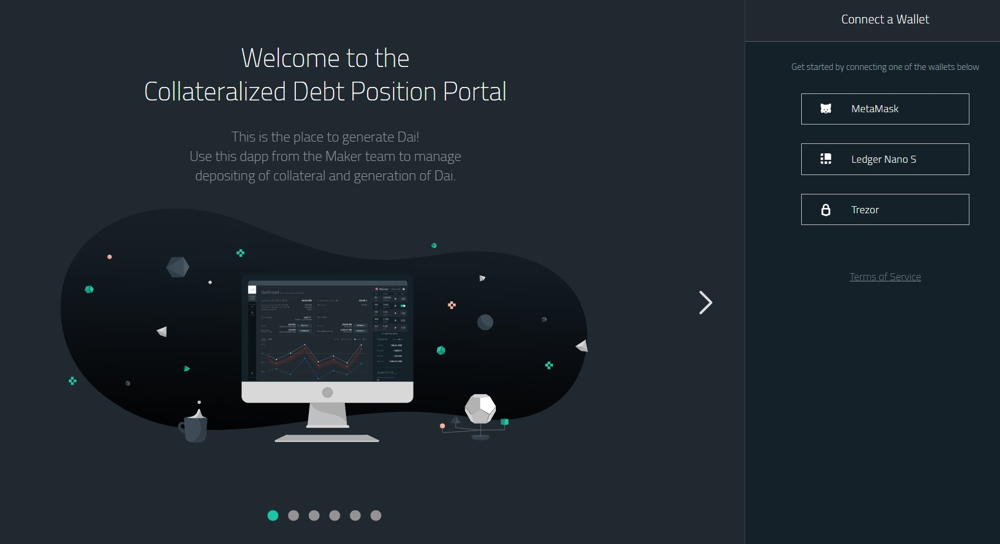
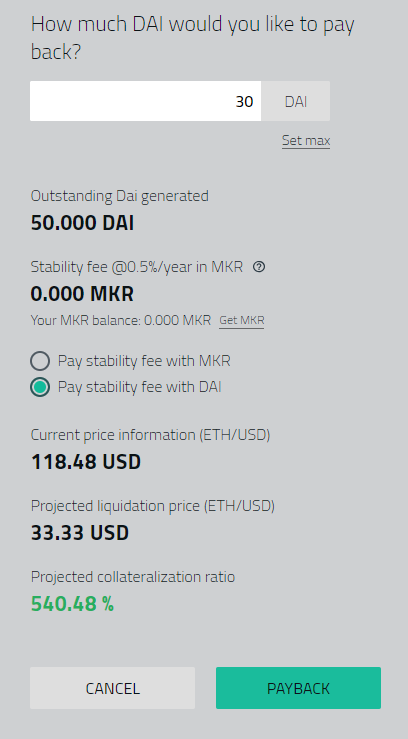
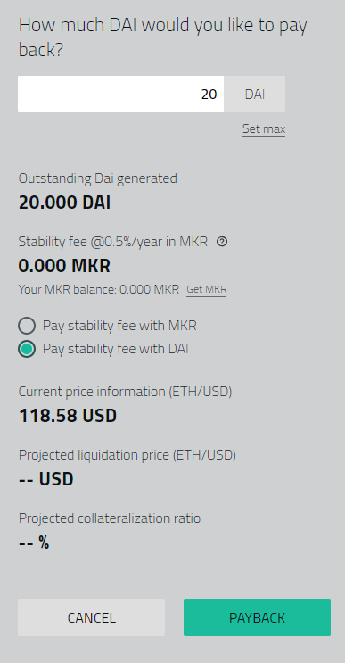
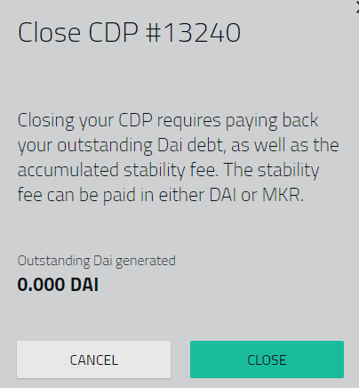

Decentralized Finance (DeFi) is a new field in [blockchain](https://bitfalls.com/2017/08/20/blockchain-explained-blockchain-works/) which successfully removes banks and middlemen from financial transactions.

In this post, we'll focus on loans and stablecoins via MakerDAO. In the next post, we'll look at how to put it to use - get the money to _work for you_.

## MakerDAO and CDP

A CDP is a _collateralized debt position_. In layman's terms, this means you can take a debt (a loan) and put down collateral that guarantees you'll repay it. If you don't, your collateral can be liquidated to repay your debt. It's like mortgaging your crypto.

### DAI and MKR

[MakerDAO](https://makerdao.com) is the organization behind the DAI stablecoin. The DAI stablecoin (1:1 ratio with USD), unlike other stablecoins, is not based on fiat deposits in a bank somewhere, but is instead generated by putting ether into a smart contract as a guarantee, which then lets you borrow the DAI. As you repay your DAI (with 0.5% per year interest), you get your deposit back. The deposit is liquidated (turned into your loan repayment) if the price of Ether drops too much (data provided by several trusted oracles - secret, external data providers known only to the Oracle team at MakerDAO, and the system's biggest weakness) but if you start approaching the liquidation threshold, you can simply repay some DAI or add more Ether into the position to shift the balance slightly to your favor. We'll see an example of this in the step by step process below.

Additionally, MakerDAO has the MKR token which is kind of like the "shareholder" token of the MakerDAO organization. It's what's used to get extra liquidity when not enough collateral is in the system to repay everything.

### The purpose of MakerDAO and DAI

Effectively, this lets you:

1. Get a loan in DAI (dollars) based on your crypto holdings
2. Use the DAI in any way you want
3. Repay the DAI when you're ready to get your collateral back

If the value of ether rises, you repay the DAI and have more valuable ether. Alternatively, you can use the rising value to produce more DAI because rising ether price increases your collateralization ratio. If the value of ether drops, you're safe for as long as your ratio is above 150%.

Example: if you used 1 ether to generate 60 DAI at an ether price of 120 USD, your collateralization ratio is 200% (120/60). However, if the price of ether falls to 90 USD, then your collateralization is at risk of being liquidated and the first user who notices that you're under 150% can trigger this liquidation procedure. The liquidator gets a small reward to incentivize finding bad loans, and your loan is liquidated, penalized, and the rest of your collateral is returned to you.

Ok, let's try making some DAI.

### Minting DAI

MakerDAO's CDP process supports [MetaMask](https://bitfalls.com/2018/02/16/metamask-send-receive-ether/), [Ledger](https://bitfalls.com/2017/09/08/hardware-wallets-like-ledger-nano-s-work/) and Trezor. Go to [cdp.makerdao.com](https://cdp.makerdao.com).

We'll use MetaMask in this case. Unlock your [wallet](https://bitfalls.com/2017/08/31/what-cryptocurrency-wallet/) which has some ether in it, and you'll see the following screen:

The screen will list how much ether you have in the unlocked wallet, and the other assets important to MakerDAO alongside that. Specifically, it will list your DAI balance, and your MKR balance. 

*Note: Because DAI and MKR are ERC20 tokens, there is a checkmark next to them in the "Unlock" column. Clicking these issues transactions that make it possible for MakerDAO's smart contracts to manage these assets for you (i.e. to take them from you in certain amounts, and to give them back to you). This is important for using the system, so it's best to unlock them now, you'll probably have to do it later anyway.*

Let's open a CDP now with our 0.9 ether. **Never collateralize all your ether - you'll need some for transaction costs**. Click "Open CDP".

This screen lets you choose how much ether to deposit and how much DAI to generate from this deposit. I'll choose a safe collateralization ratio od 217% by generating 50 DAI for 0.9 eth.

The next screen will tell you that CDPing is a process of 7 automated transactions. Feel free to expand that tab to find out what those transactions are and why they are necessary, we won't go over them here. Confirm and wait a bit for everything to go through.

Once done, you will be able to inspect the transaction linked on the confirmation dialog and see what happened and how much it cost in ether and gas.

We now have our CDP.

The screen lets you perform one of four actions:

- **Deposit** lets you "top up" the CDP with more ether, to increase the collateralization ratio and avoid being liquidated.
- **Withdraw** lets you withdraw ether to the point of 150% collateralization. You can withdraw less than that, of course, if you urgently need some, but each withdrawal brings you closer to the ratio's 150% limit.
- **Payback** lets you cover the loan in part or in full by paying back your borrowed DAI. Paying back in part lets you increase collateralization ratio, just like depositing Eth would, while paying back in full lets you close the CDP.
- **Generate** lets you generate more DAI, reducing your collateralization ratio. Extra useful when ether rises in price dramatically - lets you extract more DAI for the same amount of eth!

At this point, DAI is in our account as evident by the right hand side of the screen. This can also be easily verified by checking the actual wallet.

We can now use the DAI in exchanges that support it, purchase [goods online](https://ava.do), speculate on other cryptos, or any number of things.

_Note: some time in the near future, MakerDAO will enable collateral in multiple assets. You will no longer need to use ether exclusively._

## Closing a CDP

To close a CDP and get your collateral back, you pay back the full amount. Click Payback but... whoops! What's this red warning??

The MakerDAO system lives by being additionally collateralized as a whole with the MKR token. As such, it charges for the "stability fee" in MKR tokens, or alternatively in DAI. When paying back any amount of generated DAI, you need to also cover this stability fee. But if you're paying with all the DAI you have and you have no MKR, you cannot close your CDP. This is a UX nightmare as it's not made clear when creating a CDP. I would recommend the MakerDAO UX team address this urgently.

Thankfully, there is a workaround in times of crisis. If the price of ether starts dropping rapidly and you're at risk of liquidation, you can pay back part of your DAI and choose to pay the fee in DAI. This way you increase your ratio and buy yourself some time, in addition to significantly reducing your exposure - the remaining loan is now small, so the liquidation will be much smaller too on the off chance it actually occurs. Let's see how a partial payback would work.

Well, can't argue with that ratio! The chances of liquidation (i.e. ether dropping to the required 33 USD) are extremely low. Inspecting the DAI balance, we also see that this stability fee cost us less than _seven millionths_ of a DAI. 

DAI dust, we call this. Still enough to create trouble - so always make sure you have either some MKR dust, or some DAI dust, in addition to what you're paying back.

Okay, now let's top up our account from elsewhere with some MKR or DAI to cover this dust (decentralized exchanges like Idex, OasisDex, Kyber and similar work pretty well and need no verification) to completely close this CDP. I'll use DAI to repay the remaining 20 DAI in full and close the CDP.

A few transaction confirmations later our CDP will be empty. It won't be gone, however! You can still use it - it's like you have your own personal platform for these loans open now and can reuse it at will. To totally delete it, you can click the "Close CDP" button at the top which will again inform you that you need to pay back the outstanding DAI. 

Already done, so closing is cleared!

## Liquidation

So, what happens when the collateralization ratio drops beneath 150%?

If you're the debtee, you are exposed to liquidation. 13% of your collateral will be takes as a penalty, the rest will be liquidated into whatever is needed to pay back the debt. If you're a bystander who notices someone's defaulting loan, however, you can use this to your advantage through [certain bots](https://developer.makerdao.com/keepers/), but that's outside the scope of this article.

For more information about liquidation, this [excellent FAQ](https://www.reddit.com/r/MakerDAO/comments/8efk5q/faq_possibly_everything_you_ever_wanted_to_know/) is a gold mine of information.

---

Up next we'll explore how to take proper advantage of the generated DAI.