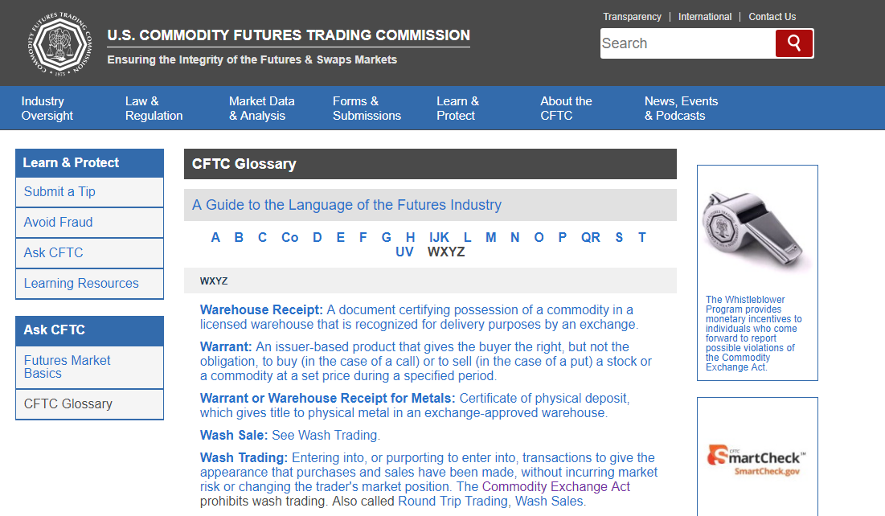
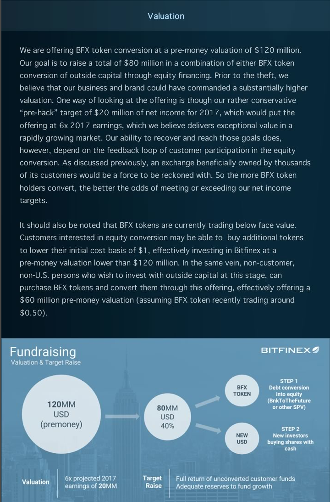
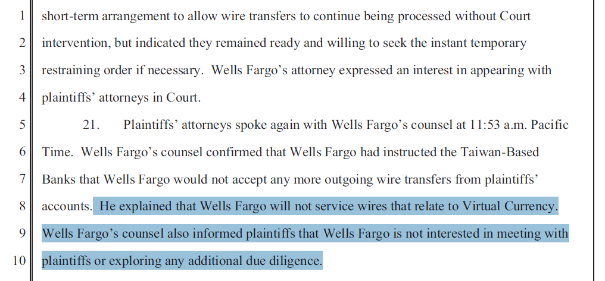
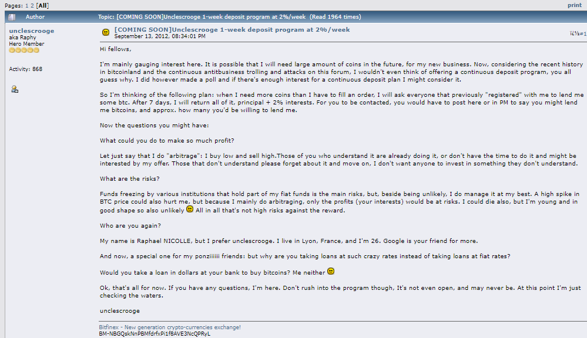

# [Wash Tradeing](https://bitfalls.com/hr/glossary/#wash-trading) Bitcoinom ili kako Bitfinex ostvaruje korist od fiktivnog trgovanja...

*Wash trading* je **epidemija** Bitcoin tržišta. Za one koji još nisu svjesni značenja pojma - to je kada osoba ili entitet prodaje i kupuje vlastite naloge na tržištu kapitala.

Za detaljnije objašnjenje pogledajte [ovdje](http://www.investopedia.com/terms/w/washtrading.asp) ili kraće [tu](https://bitfalls.com/hr/glossary/#wash-trading).

Od mojeg prvog posta nadalje, upozoravam ljude na *[WT](https://bitfalls.com/hr/glossary/#wash-trading)*. [(Link)](https://medium.com/@bitfinexed/meet-spoofy-how-a-single-entity-dominates-the-price-of-bitcoin-39c711d28eb4)

Izvorno sam mislio da se sve to odvija preko dva odvojena korisnička računa koja kontrolira isti entitet. Naime, kako sam saznao iz pouzdanih izvora, ovo je čak i jednostavnije od moje početne pretpostavke. Nove informacije koje sam sakupio od raznih *tradera* ukazuju da je ovo djelovanje vrlo vjerojatno u rangu kriminalne operacije. Krenuo sam od pretpostavke da se radi o dva odvojena računa - jer kako bi [Bitfinex](www.bitfinex.com) dopustio konkurentne naloge prodaje i kupnje sa **ISTOG** korisničkog računa? To bi stvarno bilo izrazito glupo, nije je li tako?

> **E PA BIO SAM U KRIVU**

## Prljava mračna tajna Bitfinex-ovog *trade* enginea...

Želim da zamislite kompaniju koja izrađuje avione. 

Kako bi kompanija bila u mogućnosti sastaviti avion potrebno je sakupiti sve resurse potrebne da dobijemo konačan proizvod. Naime, trebamo izgraditi krila, pilotsku kabinu, trup, rep, motore, prozore, vrata te sustave za održavanje života - kao i sve ostale druge dijelove koji sačinjavaju sam avion.

Sada želim da pomislite kako Bitfinex gradi svoj avion. Njihov avion ima sve što izvana izgledom djeluje kao pravi avion. Laiku sve djeluje normalno na prvi pogled. Jer smo naučeni da ako izgleda kao patka, ako se glasa kao patka i ako hoda kao patka - da je to onda zasigurno patka. Ali...

Potrebno je sada zamisliti sljedeći detalj - taj avion zapravo nema spremnik za gorivo. I Bitfinex prodaje taj avion, znajući da nema spremnik za gorivo. 

Vrlo je izgledno kako niti jedan odgovoran proizvođač aviona na svijetu ne bi sebi dopustio pogrešku tog reda veličine - jer je toliko nevjerovatna da biste se morali zapitati je li to možda namjerno napravljeno.

Sada imamo predodžbu Bitfinex-a kao kompanije - koja je izgradila avion i koja je s namjerom izostavila uključiti i spremnike za gorivo. Nitko razuman neće očekivati da će takav proizvod ispravno funkcionirati, no oni su unatoč svemu napravili takav proizvod i prodali (čit. podvalili, op.a) ga svojim investitorima. 

I vrlo je vjerovatno kako su cijelo vrijeme **svjesni** što zapravo čine. 

## PSA: Bitfinexov *trade engine* dozvoljava *Wash Trade*

Znači, na Bitfinexu možete komotno kupovati i prodavati vlastite *ordere*, a procedura je kako slijedi... (imajte na umu da bi ovo moglo biti "popravljeno" ili pokrpano nakon ovog posta)
1. Postavite *buy* ili *sell* nalog. Za BTC ili bilo koji drugi coin ili *trade* par kojim se može trgovati na Bitfinex-u.
2. Postavite suprotan nalog onome kojeg ste napravili u *Koraku 1*. 
3. *Trade engine* će izvršiti oba naloga. 

Ovako to izgleda vanjskom promatraču:

<iframe width="700" height="393" src="https://www.youtube.com/embed/-gY6VOEk2r4" frameborder="0" allowfullscreen></iframe>

*Ovo je najočitiji primjer WT-a. Ispravno odrađen WT je neuočljiv vanjskom promatraču.*

Developer koji piše kod za *exchange engine*, na nekom regularnom *exchangeu*, kao prvi zadatak isplanira programirati kod koji ne dopušta izvršenje oprečnih naloga sa istog korisničkog računa.

Ne postoji iole jedna legitimna isprika ili valjan razlog zašto bi se trebalo moći trgovati sam sa sobom tj. moći izvršiti *WT* - osim kako bi se manipuliralo tržištem. No najveći razlog zašto bi neki *exchange* želio zabraniti *WT* je zato jer je **TO ILEGALNA AKTIVNOST**.

*[(Izvor)](http://www.cftc.gov/ConsumerProtection/EducationCenter/CFTCGlossary/glossary_wxyz)*

Ukoliko mi ne vjerujete i mislite da samo širim [FUD](https://bitfalls.com/hr/glossary/#fud) o *WT-u* i da ga koristim "za sve stvari koje nisu crypto" - imamo i primjer iz stvarnog svijeta. 

LedgerX je novo lice na tržištu i mjesto je za razmjenu BTC-a. Činjenica je kako je potpuno reguliran od strane CFTC-a. Primijetiti ćete u dokumentaciji njihovog API-a da će bez problema odbiti svaki nalog koji bude detektiran kao *WT*.

*http://docs.ledgerx.com/*

Kod Bitfinexa ne postoji takva mehanika koja bi priječila izvršenja sličnih naloga. 

Kao rezultat svega navedenoga, možemo svjedočiti događajima gdje su ljudi uspješno *WT-ali* desetke milijuna dolara u Bitcoinu. To je pomoglo fiktivno povećati volumen trgovanja na Bitfinexu.

*WT short pozicija na Bitfinexu*

**Bitfinex priznaje kako ima Wash Tradere među svojim korisnicima**

*[(Izvor)](https://www.bitfinex.com/posts/214) [(Arhiva)](http://archive.is/lNWAY)*

Ironija u svemu ovome jest:

1. Tvrde kako je *WT* direktno kršenje njihovog T.O.S.-a.
2. Njihov vlastiti engine dopušta izvršenje konkurentskih naloga istog računa. Nešto što je trivijalno za spriječiti.
3. Nisu popravili *trade engine* nakon 01.08.2017, gdje su već imali desetke milijuna dolara u *WT-u*.

Kako smo mogli vidjeti u drugim člancima, *traderi* na Bitfinexu su dobro iskoristili priliku prilikom BCH distribucije i načina na koji je sprovedena. Slijepo vjerovati kako neće *WT-ati* cijenama i uzrokovati rast ili pad istih je daleko od onoga što se je dogodilo na tržištu. 

Isti su izvršili 10 milijuna dolara u lažnim transakcijama kako bi "ukrali" BCH. Bez razmišljanja su iskoristili *WT* kako bi izbrisali pozicije regularnih ljudi u bilo kojoj situaciji. Garantiram kako je vrlo vjerojatno da Bitfinex nije kaznio niti jednog takvog *tradera* - kao što nisu spriječili djelovanje *spoofera*, što je podjednako legalno kao i *W.T.*.

**Gle, očito ovo mora biti neki bugić...**

Pa sada...zaključite sami iz sljedećeg:

Phil Potter koji je Chief strategy officer, u jednom od intervjua je upitan sljedeće pitanje:
>"Da razjasnimo, da li još uvijek dopuštate praksu samo-financiranja i izvršavanja onoga što zovemo *1x hedge shorts*? Da li je ovo još generalno dopušteno?

**OPASKA: Ovo je vrlo KREATIVAN način da se opiše Wash Trade!**

>Phil Potter, CSO: "Ovisi o svrsi takvog naloga."

>Kasnije Phil Potter spominje: "Mnogo ljudi je samostalno izvršavalo WT naloge."

Ovo je samo moguće ukoliko *trade engine* to omogućuje - a pokazali smo da to i čini. 

Pitanja idu dalje...

>"Znači, što se pravilnika o djelovanju tiče, izgleda da Bitfinex još uvijek dozvoljava ovakvo trgovanje, ali situaciju sagledava od slučaja do slučaja. Da li to znači kako je bilo određenih situacija gdje su te manipulacije iziskivale sankcije za uključene *tradere*?

Phil Potter, nažalost, daje krivi odgovor: 

>Nisam u mogućnosti potvrditi da je način na koji ste to izrazili točan...

*[Wash Trade](https://bitfalls.com/hr/glossary/#wash-trading)* je ilegalna aktivnost, čak i gora od *spoofinga*, jer volumen trgovanja direktno utječe na vrijednost njihove kompanije. Phil Potter **zna** da njihov *trade engine* spremno izvršava *WT* naloge. 

On nije (toliko) glup čovjek.

Činjenica je kako velik broj ljudi u kripto svijetu čvrsto vjeruje u mantru - "KOD JE ZAKON". Kako je Bitfinex-ov *trade engine* programiran na način da dozvoljava izvršenje *WT-a*, mnogo toga postaje jasnije. **Njihov *KOD* za ključan dio trgovanja je u direktnom kršenju njihovog Terms of Service-a.** (Sukob interesa - anyone!?)

I čini se da je to tako bilo od dana kada je Bitfinex započeo sa radom.

<iframe width="700" height="393" src="https://www.youtube.com/embed/_xiXP8HsRUw" frameborder="0" allowfullscreen></iframe>

*Bitfinex dopušta WT...*

**Bitfinex je prevario svoje investitore?**

Bitfinex je vrlo vjerojatno provodio *WT* od početka svojeg djelovanja - no ključno je pitanje, na koje nemamo odgovor - **koji postotak ukupnog volumena trgovanja otpada na *WT*?**

Ako se sjećate, Bitfinex je izdao temeljni kapital i prodao ga ljudima u obliku BFX tokena. A kako su odredili vrijednost kompanije? **Volumenom trgovanja i očekivanim naplatama naknada za trgovanje**.

Bitfinex je svjestan svoje virtualno napuhane vrijednosti kroz propust u *trade engineu* svejedno prodao ljudima Patka Token aka BFX. 

U ožujku 2017, Bitfinex povećava vlastitu valuaciju sa $200 na $250 milijuna dolara. Phil Potter priznaje kako je ovaj potez ponukao investitore da ulože u temeljni kapital društva. 

<iframe width="700" height="393" src="https://www.youtube.com/embed/8ax46xdds5A" frameborder="0" allowfullscreen></iframe>

*3. travnja, intervju s temom povećanja valuacije*

Bitfinex se je našao u škripcu. Tvrdili su kako im njihov vlastiti "BFX" token uzrokuje probleme u reviziji poslovanja kao i da priječi uspostavljanju odnosa sa bankama, te su brzo pokušali umiroviti tokene i uvjeriti vlasnike istih da ulože novac u kompaniju.

Iako je prošlo (+)6 mjeseci od umirovljenja BFX tokena, još uvijek nema banaka sa kojima posluju. 

**Vrednovanje kompanije**

Interesantno je vidjeti iduću relaciju - čini se kako je gubitak potpore bankarskog sektora = porast vrijednosti kompanije.

Originalna valuacija je bila $120 milijuna dolara (temelj koje je - **porast zarade od 6x** *koja se pak temelji na* **volumenu trgovanja**). Također su planirali tražiti dodatnih $80 milijuna dolara financiranja što možemo vidjeti iz informacija za *shareholdere*.

*Shareholder info*

Zanimljivo je da su uspjeli prikupiti novac izdajući BFX tokene koji su bili I.O.U. prema investitorima. Problem leži u činjenici da iako su se investitori odlučili zamijeniti BFX token za udjel u temeljnom kaitalu - to nije direktno stavilo novac na račun Bitfinexa kojim bi oni mogli raspolagati. Postoji mogućnost kako je to razlog zbog kojeg su dodatno povećali valuaciju za nemalih $50 milijuna USD.

Tko bi rekao da to tako funkcionira?

*Gdje smo ovo već mogli vidjeti? [(Točno tu)](http://archive.is/Zl3SD).*

Pitam se jesu li svi oni koji su imali BFX token, a izgubili su novac u *hacku*, kao i oni koji su bili pitani da zamjene svoj I.O.U. za udio u vlasničkoj strukturi bili informirani o trenutno navedenim činjenicama prije nego su izvršili zamjenu?

Ukoliko nisu, ovo postaje kriminalni akt sa ciljem utaje ključnih informacija. 

Bitfinex je već 23. ožujka bio svjestan svojih potencijalnih bankovnih problema - a službena obavijest od Wells Farga zaprimljena je 31. ožujka. 

Upitna je količina BFX tokena koja je bila pretvorena između 23.03 i 03.04. bez da su informirali ljude o situaciji u kojoj se nalaze.

*Bitfinex priznaje kako je njihova tužba prema Wells Fargu - sra***, čak i prije nego su je predali sudu.*

Osobno smatram da bi javna objava Bitfinexa kako imaju probleme sa bankama imala zasigurno negativan utjecaj na konverziju BFX tokena u vlasničke udjele... pa djeluje kako su pričekali dok se sve ne završi prije nego su ljudima javili loše vijesti.

**Bitfinex je iskoristio takozvane rezerve kako bi isplatili preostale tokene koji nisu bili pretvoreni u vlasničke udjele u temeljnom kapitalu.**

<iframe width="700" height="393" src="https://www.youtube.com/embed/19kng-Bm-l4" frameborder="0" allowfullscreen></iframe>

*Isplata novcem korisnika*

1. Ove rezerve su došle od sredstava koja su pasivno zaplijenili od svojih korisnika sa depozitima. 
2. Nemojmo zaboraviti da nakon što su se našli u blokadi od banaka, korisnici nisu bili u mogućnosti isplatiti dolare na svoje račune. Jedini način na koji su ljudi mogli doći do svojih sredstva je bilo kupiti Bitcoin od Bitfinexa. To je uzrokovalo vrtoglav porast cijene. 
3. Svi navedeni intervjui su datirani 03. travnja. Nigdje se ne spominje situacija sa bankama koja je ključna informacija. Naime  pitanja nisu bila postavljana oko ove teme. Jedan od sugovornika u intervjuu djeluje kao da je svoje tokene zamijenio za udio ali se uopće ne da naslutiti kako postoji svjesnost oko situacije sa bankarskim sustavom. Da li je moguće kako su tu informaciju uskratili i trenutnim vlasnicima udjela kao i potencijalnim ulagačima? 

## Recap ili dedukcija informacija koje smo izložili kroz tekst:

Bitfinex vrednuje vlastitu kompaniju temeljem ostvarene zarade koja se bazira na volumenu trgovanja. To je statistički podatak, za kojeg su znali da ga je moguće umjetno napuhati kroz *wash trade*.

Bitfinex vrlo vjerojatno propušta pravovremeno izvjestiti trenutne BFX token investitore o svojim problemima sa bankarskim sektorom. Što je indirektna prevara. 

Da ste Vi u poziciji BFX token holdera i da Vas pitaju da na zamijenite BFX tokene za udjele u kompaniji - a da ste svjesni situacije sa bankama - biste li to učinili?

Da ste znali da je njihov *exchange* mjesto gdje se odobrava *WT* i da je vrijednost njihovih udjela temeljena na volumenu trgovanja, biste li prihvatili udjele u toj kompaniji?

Vrlo vjerojatno - **NE**.

Predložak novog loga Bitfinexa.

*Prijedlog Novog Logotipa za Bitfinex - samo su zaboravili napomenuti da je kiseli aftertaste ključan dio poslovanja sa nama...*

## Zaključak:

Činjenica je da nikada nećemo saznati koji je udio u ukupnom volumenu trgovanja otpao na *Wash Trade*. Šanse su, da ako su svjesno dopustili *WT*, nisu ostavili mnogo traga kroz logove čija je ispravnost upitna. 

Pretpostavka je kako nisu imali namjeru da im transakcijski logovi procure te da kroz informacije sadržane u njima svi dobiju uvid u interno funkcioniranje. Tu se možemo prisjetiti kako su transakcijski logovi Mt. Goxa procurili i gdje su svi mogli vidjeti detalje o Marcusu i WillyBot-u.

Bez tih logova, do danas ne bismo znali što se je dogodilo sa Mt. Gox-om.

Vrlo je izgledno da se je *WT* odvijao na Bitfinexu od prvog dana. A ako sagledavamo čovjeka prema društvu ljudi u kojemu se nalazi - činjenica je kako je osnivač Bitfinex-a isto tako bio dio kruga ljudi koji su promovirali Ponzi shemu, a i sam je pokušao zavrtiti vlastiti spinoff istoga. 

Osim osnivača, čini se kako niti ostatak ključnih ljudi Bitfinexa ne zazire od korištenja manje etičkih pristupa poslovanju (kao što je insajdersko trgovanje i sl).

<iframe width="700" height="393" src="https://www.youtube.com/embed/DcIed4A8NIM" frameborder="0" allowfullscreen></iframe>

*Phil Potter ne trguje Bitcoinom. Prodaje ga kada raste i kupuje kada pada. Suprotno uvriježenom mišljenju - ovo zaista nije bilo samo trgovanje.*

Bitfinex će vrlo vjerojatno spremno odbaciti sve ove optužbe. Možda će i popraviti svoj *trade engine*. A nije nemoguće da funkcionalnost *WT-a* bude uskraćena malim investitorima ali možda [Whale]( https://bitfalls.com/hr/glossary/#whale) zadrži tu opciju. 

Izgledno je kako je Bitfinex-ov *engine* - koji ne sprečava *WT* - ciljno programiran sa tim *feature-om* na umu, a ne trivijalni propust programera. 

Dodatna potvrda te namjere je činjenica da to nisu ispravili nakon 01.08.2017. kada je situacija sa BCH došla na vidjelo.

Moj je savjet kako sve tvrdnje od strane Bitfinexa treba uzeti sa dozom skepse, jer smo mogli vidjeti kako je Phil Potter iz Bitfinexa prvo nijekao *spoofing*, a ja sam prikazao video sa dokazom $14 milijuna USD teške *spoof* aktivnosti. 

Jedan od razloga zašto i snimam sve trade aktivnosti je činjenica kako grafovi i povijest kretanja cijena rijetko daju pravu sliku onoga što se je odvijalo u dnevnim aktivnostima trgovanja.

Trgujte pažljivo...

-Bitfinexed
