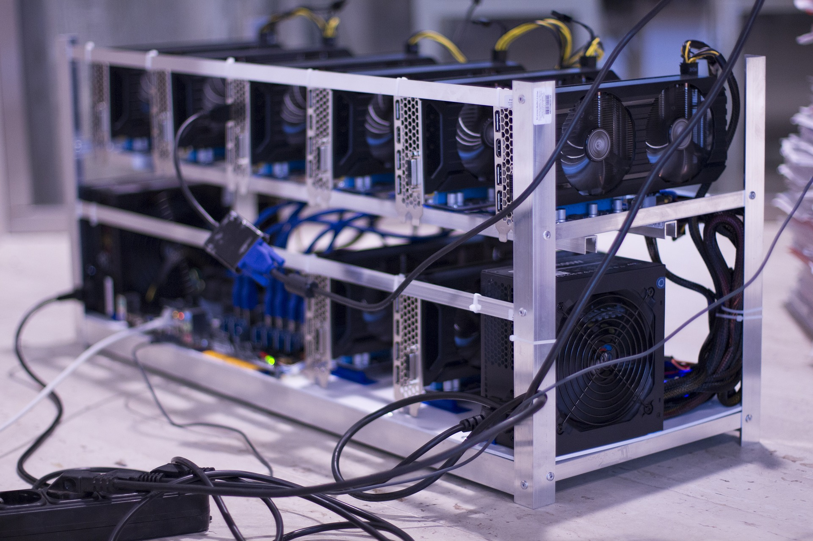
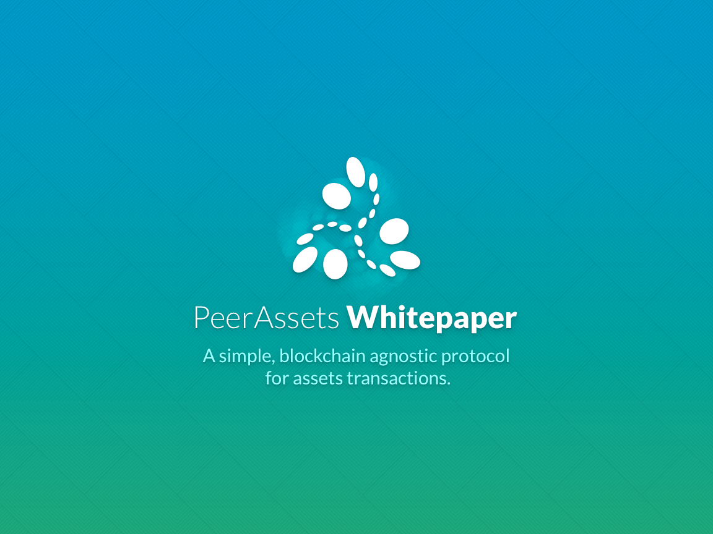

Scalability, energy consumption, slowness, costly transactions – all these are problems that some [blockchains][4] like Bitcoin are already facing. In order to generate new coins and keep the network safe, a majority of today’s [cryptocurrencies][cc] are using a process which involves extremely challenging tasks of solving complex mathematical problems. This is known as [proof-of-work (PoW)][1] and it requires constantly operational computing systems to compete on who will be the first to solve a given problem – a process also known as [mining][2]. A question of long-term profitability of this approach is raised, given the fact that energy prices tend to move up, especially considering the reduction of [mining rewards][rew] which makes a certain cryptocurrency less appealing to miners. That’s where Peercoin kicks in with an alternative approach.

In this article, we’ll be analyzing Peercoin’s key functionality, including its architecture, new coin generation, how to acquire the coins, and we'll see which projects are being developed based on it. If you happen to be unfamiliar with this topic, we strongly suggest you read our introduction to [cryptocurrencies][3], and to the technology that made cryptocurrencies possible: [blockchain][4]. 

## What is Peercoin and how does it work?

Also known as PPCoin and PPC, **Peercoin is a cryptocurrency which introduced the use of the proof-of-stake (PoS) method of network security**. It was presented in the[whitepaper][5] in mid-2012, written by core developers Sunny King and Scott Nadal. According to that document, Peercoin, although formally based on the core Bitcoin technology, combines [PoW and PoS][1] methods. PoW was dominant in the early stages of token generation and is now almost fully replaced with PoS. The method was developed as a response to potential security and long-term sustainability issues of a pure PoS system.

The fact that the mining reward decreases over time can have a negative impact on the presence of extremely important miners in the ecosystem, thus enabling the concentration of mining power in one place. The person who controls over 50% of mining power can theoretically duplicate all transactions and send all tokens to his own address, thus seriously endangering the stability of the cryptocurrency. This is called a [51% attack][6]. Also, the amount of energy spent in order to power special mining devices is enormously high, making the PoW method questionably profitable, especially combining this with the aforementioned mining reward decrease. Compensating this with raising transaction fees in order to keep the miners reduces the practical usage of a given cryptocurrency. In general, the more profitable it is to mine a cryptocurrency, the more desirable and secure it will become.

The Proof-of-stake method generates coins based on the amount and age of those kept in a user's [wallet][7]. Peercoin suggests this method as the main basis for keeping the blockchain secure, while the mechanism of selecting the next block forger is based on the so-called *coin day*. This value is the product of the token amount and time they’ve been sitting in a user’s wallet. This concept required a slight modification of the core Bitcoin blockchain by adding the *timestamp* of each transaction, thus making the process of calculating coin days easy. 

**The PoS method unites miners and owners so that every network participants plays both roles.** It’s important to note that only coins that were kept in a wallet for at least 30 days can compete in creating a new block. As time goes by, block generation chances are increased, but when coin age reaches 90 days, the chances are maxed out.

Peercoin solved the potential monopoly problem of users owning high amounts of coins that laid intact in their wallets for a long period of time in a very interesting way. While block generation is in progress, a transaction is being processed where the user that founded the new block sends his participating coins to himself. This way, the coin age of these coins is being reset, and the user gets the block generation reward as a substitute. In order to participate in block generation again, he must keep the same coins in the wallet for at least 30 days, and the process starts from scratch. We should emphasize that the [minting][8] (the term for creating blocks via PoS) reward is lower than the one for mining other cryptocurrencies, as it doesn’t involve the sum of transaction fees. These fees (currently about 0.02 USD per transaction) serve a different purpose here, which we’ll talk about later on.

## Advantages of Peercoin 

The concept of coin age is an efficient solver of the problem of determining the main chain after separating the blockchain to 2 identical ones ([fork][9]), in cases when a part of the community disagrees with the coin’s future development plan. A good example for that can be found in the recent [Bitcoin Gold fork][10] that deeply divided the community, thus showing how a huge amount of cryptocurrency in wrong hands, combined with the fairly new market full of inexperienced traders can endanger the whole ecosystem. Peercoin determines the main chain based on the data of “spending” coin age for each transaction in each block. The main chain is the one that has a bigger total amount of spent coin age – this is the proof that this chain has existed longer.

Also, due to the PoS system, Peercoin is much less susceptible to a potential 51% attack. Given the fact that by keeping Peercoin in an encrypted wallet unlocked only for minting the user makes the network more secure while also increasing his chances of generating a new block, the majority of coins is located in wallets instead on exchanges. A potential attacker would have to own over 51% of total coin age of all coins participating in the minting process, which is a considerable effort due to the fact that they are located in wallets. The investment for executing such an attack would quickly rise exponentially, because the price of a single Peercoin would grow significantly due to the high demand. Moreover, by purchasing an excessive amount of coins, the attacker would actually harm himself, because his actions would cause the price of Peercoin to drop if he decides to cash them out.

The most prominent advantage of this cryptocurrency is definitely its long-term sustainability due to much lower requirements towards electricity. Actually, the only requirement is having enough power to keep computers and devices that function as network nodes on. Also, transaction costs are significantly lower compared to many more known cryptocurrencies and, as we mentioned earlier, they are not given to the block founders as a form of prize.

Instead, **all transaction costs are destroyed permanently** in order to compensate and control inflation rate of the currency, which happens over time due to the generation of a high number of blocks and associated coins. A fixed price of 0.01 PPC per kilobyte of processed transaction is defined which, combined with the coin generation via both PoW and PoS methods, results in expected yearly inflation of 1-3%. Given the fact that, along with PoS method, **Peercoin is the first currency to introduce the unlimited token supply** so the final number of issued tokens is unknown, this system is economically sustainable in the long term.

## Checkpoints

One of the most criticized functionalities of Peercoin are the so-called *checkpoints*. In the whitepaper, Sunny King addresses them as “protection of history”, in case there are conditions for an attack that could take control of the network, such as a double spending attack. King claims that development efforts in creating a distributed network of checkpoints failed, so they’ve implemented a centralized broadcasting model. In practice, checkpoints serve as a safety switch in the events of critical problems in network functionality (something like System Restore functionality in Windows).

Of course, the community tends to furiously convict any attempts of centralization, especially because decentralization is one of the core concepts of this technology. Even Sunny King admits that checkpoints centralization was a temporary solution until a better alternative is provided, and it's [important to note][red] that checkpoints are actually on the clients (wallets) not some kind of big central server. Serving as protection against attacks in the network’s early stages, checkpoints are still active, but with the network growing stronger, they tend to lose their purpose. When [upgrading the network to version 0.6][11], users have the option to opt out of receiving checkpoint broadcasts, the feature that can be turned on again any time. It is advised to do so after the announcements of crucial updates, forks, and network changes.

## How to obtain Peercoin?

There are four main ways of getting your PPC tokens:

- Buying them on an exchange or on [Coinvendor.io][cv],
- Swapping for other cryptocurrencies,
- Mining,
- Minting.

For those willing to try out Peercoin mining we should note that since it is directly based on the core Bitcoin blockchain and its SHA-256 mining algorithm, Peercoin now requires powerful and specialized machines for creating blocks through the PoW method – the so-called [ASIC miners][14]. Naturally, the question of long-term profitability of initial investment is raised, which could reach several thousand dollars, especially due to the fact that Peercoin doesn’t prefer this method. Mining generates a block of 820 bytes roughly every 10 minutes, with the reward of approximately 90 USD per block making profitability, in accordance with the initial design, greatly reduced. For those who do want to try out mining or just get to know something more about the process, a good guide with the list of available mining pools can be found on the [official website][15]. Of course, before actually beginning with mining, we strongly advise you to do mining profitability calculation by using one of the [online calculators][16].

The concept of minting which makes you an owner and miner at the same time, thus contributing to the overall network security, is fantastically described on the official [blog][17] where you can find reasons to join in, how to enable minting on your wallet, how safe the procedure is, and so on. Minting usually gets you 1% annual income of coins that are participating in minting.

Regardless of the approach you take, you definitely want to own your own wallet for long-term coin keeping. Peercoin has its own official [desktop wallet][18] for Windows, Mac, and Linux computers that gives you all the key functionality regarding coin transfer and minting, but bear in mind that it requires the download of the whole blockchain (less than 1 GB). The official [Android wallet][19] is there as well, and you can create your own [paper wallet][20] for safekeeping. Also, if you prefer multi-currency wallets, [Coinomi][21] could be a good solution.

## Projects based on Peercoin

Peercoin’s blockchain is, due to its long-term self-sustainability and constant updates following the quick technological development of Bitcoin’s core architecture, an ideal platform for creating more advanced solutions. Here lies the potential and the future of this cryptocurrency, primarily thanks to the immense effort of core developers. We’ll mention the most prospective projects that are currently being developed.

[PeerAssets][22] is a simple, blockchain-agnostic protocol used for creating and exchanging certain assets. Its purpose is creating the simplest and most energy-efficient method of tokenizing any blockchain. This approach is different than the one used by Ethereum, where possibilities of transferring and creating assets are limited by containing unique data in transactions that can be only interpreted on the underlying blockchain. 

The greatest perks of PeerAssets are:

- Efficiency in terms of transaction size compression, freeing most of the space on the blockchain that is reserved for transactions and enabling saving of custom codes,
- Avoiding the introduction of energy-demanding nodes for analyzing the whole blockchain in search for custom codes (parsers), by introducing a payment system involving public addresses that enable quick recognition of custom codes,
- Direct advantages of running on the Peercoin blockchain – fixed transaction costs, relatively small blockchain size, security, and maintainability, 
- The low price of custom code execution due to the blockchain structure and the volume of freed space.

There is also [Indicium][23], a decentralized autonomous company (DAC) based on the PeerAssets protocol, with the aim of creating and trading cryptocurrency indexes. Actively present in the world of finance since 1974, indexes represent a relative change of stock prices of several grouped companies, representing a specific portion of the market. As an example, a 2% index increase means that each underlying company saw an average of 2% stock price increase. 

By using the blockchain’s security and immutability as advantages, as well as the universal character of the PeerAssets protocol, Indicium plans to apply index trading to the world of cryptocurrencies. Through its own Indicium (IND) token, users will be given a stake of ownership in a company which gives the right to dividend payout, as well as to vote on executive board elections and operations. Imagine the hedge fund with complex automated trading algorithms for cryptocurrency trading, with risk minimization and decentralized decision-making system, and you’ve got yourself a basic outline of Indicium. 

The design dictates that a majority of value will be stored in cold wallets, while the smaller portion will be used for trading on exchanges. Unlike its Slovenia-based competitor Iconomi that is more focused on cryptocurrency baskets created by users, Indicium relies on the powerful algorithms and automated basket creation. The good news is that Indicium successfully completed its first round of investments, so the work will surely be continued.

## Conclusion

We won’t overdo it if we say that, in past five years, Peercoin has come a long way. Since its inception, initial creator Sunny King didn’t abandon the project and still serves as an active member of the development team. Today, Peercoin’s team consists of five main developers that have the right to commit new code, with more enthusiasts joining in. Recently, a new version came out, adding some new possibilities to existing qualities. With new development strength, accompanied by projects like PeerAssets, Indicium and many upcoming ones, the future of Peercoin looks bright, especially with the growing mass adoption of cryptocurrencies. It will be interesting to follow up its future development, both in terms of innovations and market value. 

If you want to learn more about Peercoin, track its progress or contribute to its development, the good news is that its team is extremely active in communication with the community. We advise you to check out their [Telegram][24] channel, where you can ask developers direct questions. Also, the latest news is often published on their official [forum][25], as well as on [Twitter][26].

Do you think that Peercoin might surpass some much more prominent currencies? Will the PoS method prevail? Share your opinion in the comments section!

[1]: https://bitfalls.com/2017/10/23/whats-the-difference-between-proof-of-work-pow-proof-of-stake-pos-and-delegated-pos/
[2]: https://bitfalls.com/2017/10/12/mining-investing-cryptocurrency-better/
[3]: https://bitfalls.com/2017/08/20/cryptocurrency/
[4]: https://bitfalls.com/2017/08/20/blockchain-explained-blockchain-works/
[5]: https://peercoin.net/assets/paper/peercoin-paper.pdf
[6]: https://bitfalls.com/glossary/#51-napad
[7]: https://bitfalls.com/2017/08/31/what-cryptocurrency-wallet/
[8]: https://peercoin.net/minting
[9]: https://bitfalls.com/2017/11/07/segwit2x-fork-can-expect-whos-behind/
[10]: https://bitfalls.com/2017/10/24/bitcoin-forks-bitcoin-gold-scam-stay-safe/
[11]: https://medium.com/@PeercoinPulse/peercoin-v0-6-release-2831fb4394ad
[12]: https://coinmarketcap.com/currencies/peercoin/#markets
[13]: https://shapeshift.io/
[14]: https://bitfalls.com/glossary/#asic
[15]: https://peercoin.net/mining
[16]: https://whattomine.com/coins/52-ppc-sha-256
[17]: https://talk.peercoin.net/t/the-complete-guide-to-minting/2524
[18]: https://peercoin.net/download
[19]: https://play.google.com/store/apps/details?id=com.matthewmitchell.peercoin_android_wallet
[20]: http://wallet.peercointalk.org/
[21]: https://coinomi.com/
[22]: https://peerassets.github.io/WhitePaper/
[23]: https://indiciumfund.com/
[24]: https://telegram.me/peercoin
[25]: https://talk.peercoin.net/
[26]: https://twitter.com/peercoinppc
[cc]: https://bitfalls.com/2017/08/20/cryptocurrency/
[rew]: https://bitfalls.com/glossary/#block-reward
[cv]: https://coinvendor.io
[red]: https://www.reddit.com/r/CryptoCurrency/comments/7h3ve9/the_peercoin_team_releases_its_full_roadmap_for/dqoiuxi/
