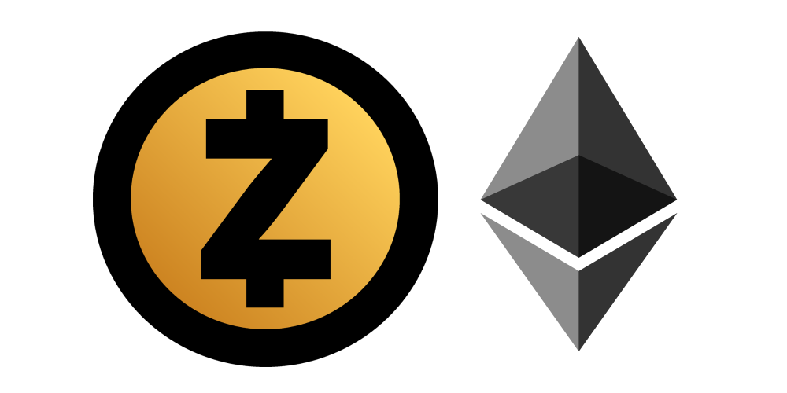

[Ethereum] projekt iako pun potencijala,  još je u povojima. Dvije godine stara kriptovaluta i dalje tehnološki napreduje zahvaljujući njezinom kreatoru Vitaliku Buterinu i timu developera. Dobra vijest je da ne planiraju stati uskoro.

Sam Ethereum projekt je podijeljen u četiri faze razvoja:
  1. Frontier
  2. Homestead (Trenutna faza)
  3. Metropolis
  4. Serenity

## Frontier

Frontier je prva faza razvoja Ethereum mreže, lansirana u srpnju 2015. godine.
Namijenjena je prvenstveno ljudima s tehničkom pozadinom s obzirom na to da je interakcija s mrežom u potpunosti bila preko naredbenog retka.

 Frontier je sastavljen od osnovnih dijelova potrebnih za funkciju mreže u svrhu učenja okruženja, testiranja i razvoja decentraliziranih aplikacija, različitih alata  i početak rudarenja Ethera.

## Homestead

Homestead je druga i trenutna faza razvoja Ethereum mreže, lansirana 14. ožujka 2014. (Pi dan), aktiviran na 1,150,000 bloku i donosi mnogo poboljšanja protokola koji omogućuju daljnja nadograđivanja mreže i ubrzavanje transakcija.

## Metropolis

Treća faza Ethereuma je vrlo zanimljiva i donosi mnogo promjena i novotarija: sigurnosna  poboljšanja, pametni ugovori će postati još pametniji i moći će se dodatno automatizirati, Metropolis također olakšava prosječnom korisniku korištenje Ethereuma s light klijentima kao što je [Status] za iOS i Android uređaje.

### Ledeno doba

Takozvano "Ledeno doba" je inicijativa koja će s vremenom onemogućiti klasično rudarenja s grafičkim karticama u Proof of Work (PoW) konsenzusu s namjerom prelaska na puno ekonomičniji Proof of Stake (PoS) konsenzus. 

*Proof of Stake bit će objašnjen u Serenity dijelu*

Poučeni uzorom zastoja razvoja Bitcoina upravo zbog ne slaganja rudara i core developera je dovela do dvogodišnjeg prepucavanja o poboljšanju skalabilnosti [blockchaina].
U međuvremenu su naknade za transakcije na Bitcoin mreži narasle na nečuvene razmjere od $5 pa čak i $100, ovisno o trenutnom prometu na mreži.

Ethereum developeri su implementirali Ledeno doba tako da ljudi nemaju izbora nego prihvatiti prijelaz na PoS konsenzus, u prijevodu rudari ne mogu držati projekt kao taoca i zadržavati napredak zbog vlastitog profita kao što je bio slučaj s Bitcoinom.

Ledeno doba s vremenom povećava težinu rudarenja i usporava nastajanje blokova dok na kraju mreža ne bude potpuno zamrznuta i neupotrebljiva.

Metropolisom se početak Ledenog doba odgađa za 18 mjeseci, te se nagrada po bloku za rudare smanjuje s 5 Ethera svakih ~20 sekundi (koliko treba za svaki blok) na 3 Ethera po bloku, kao priprema za prijelaz na PoS gdje će se nagrada još manje smanjiti.

### ZK-Snarks
ZK-Snarks (Zero Knowledge proof) je tehnologija preuzeta s kriptovalute Zcash.
Ta tehnologija omogućava da verificiramo točnost transakcije bez da je mi sami obradimo, tako da ne znamo što je točno u toj transakciji, ali znamo da je transakcija točna, to jest legitimna. Drugim riječima, ZK-Snarks nam omogućuju anonimne transakcije na Ethereumu. 

 

Pošto je Ethereum javno dostupan blockchain, tvrtke koje žele implementirati Ethereum blockchain u svoje poslovanje se boje na blockchain plasirati potencijalne osjetljive i povjerljive podatke, u ovom slučaju ZK-Snarks olakšavaju održavanje tajnosti povjerljivih podataka.

### Byzantium i Constantinople
Metropolis nadogradnja će se razdvojiti u dva stadija , to jest dvije zasebne nadogradnje nazvane Byzantium i Constantinople.

Prva nadogradnja Byzantium sadrži EIP (Prijedlog za poboljšanje Ethereum protokola) 100, 140, 196, 197, 198, 211, 214, 649 i 658. Dok Constantinople donosi EIP 86 i 96.
[Ovdje možete detaljnije proučiti  što svaki EIP donosi.]

Byzantium se trenutno testira na Ropsten testnoj mreži, smatra se da će testni period trajati 2-4 tjedna, a ako sve bude uredu, Byzantium na glavnoj mreži možemo očekivati negdje krajem listopada.

## Serenity

### Casper Proof of Stake
                                
Zadnja Ethereum nadogradnja Serenity nam donosi dugo očekivani Proof of Stake konsenzus. Glavna razlika između PoW i PoS algoritma je u tome što PoW algoritam koristi moćan hardver  koji računa hash blokova i tako validiraju blokove i transakcije, baš kao! što ime kaže, Proof of Work, strojevi ulože vrijeme i rad da bi došli do pravog hasha.

 

Dok je u Proof of Stake rudarenje virtualno. Validator na blockchain šalje posebnu transakciju koja će zaključati njegov Ether na određeno vrijeme, možemo to smatrati kao oročenje u banci, na koje validatori dobivaju dividende. 

Validatori se esencijalno klade koji će blok uči u blockchain. Ako validatori poštuju pravila protokola i uključuju legitimne transakcije u blokove, validatori će dobiti dividende.

U slučaju da validator želi uključiti ne legitimne transakcije u blok, taj validator gubi  Ether koji su oročili, tako da svaki pokušaj varanja skupo košta.

### Po čemu je PoS zapravo bolji od PoW algoritma?

* Nema potrebe za trošenjem velike količine struje. Procjenjuje se da rudarenje Bitcoina i Ethereuma dnevno potroši preko milijun dolara struje i hardvera po danu.

* Zbog puno manje potrošene struje, može se smanjiti inflacija tako da smanjimo izdavanje novih coina i stvorimo ravnotežu između novostvorenih coina i coina koji su tijekom vremena izgubljeni i uništeni, to jest možemo imati negativnu inflaciju.

* PoS se bori protiv centralizacije rudara kakvu sad vidimo s Bitcoinom u Kini, također sprječava rudare da naštete mreži, to smo također nedavno vidjeli na Bitcoinu.

* 51% napadi u kojima napadač pokušava preuzeti mrežu imajući 51% snage mreže, postaju enormno skuplji nego u PoW algoritmu, pošto napadač mora posjedovati 51% čitave valute. Ako potencijalni napadač stvarno ima toliko novaca, isplativije bi bilo da ode u prijevremenu mirovinu i zaboravi na sve. U protivnom bi te sve novce lako mogao izgubiti.

### Sharding

Svaki blockchain ima istu slabost, a to je skalabilnost. Kad blockchain dođe do točke zasićenja gdje ima više transakcija nego mreža može procesirati, brzina kojom se transakcije izvršavaju se smanjuje, nešto kao kad se cesta suzi s 4 trake na 2 trake.

Kako se automobili na cesti gužvaju u 2 trake, tako transakcije ne mogu stati u blok i moraju čekati svoj red, no još jedan problem koji se ovdje javlja je taj što tko plati veću naknadu za transakciju, njegova transakcija ima i veći prioritet.

Tako da ne samo da se mreža uspori zbog puno transakcija, nego i naknade za transakcije rastu. 

*Za usporedbu, Bitcoin može procesirati ~3-7 transakcija po sekundi, dok Ethereum može procesirati ~7-15*

Osnova ideja Shardinga je da blockchain rastavimo na puno manjih dijelova, takozvanih "Shardova" ("krhotina").

Primjer shardinga na Ethereumu, sve adrese koje počinju s 0x00 stavimo u jedan shard, sve adrese koje počinju s 0x001 stavimo u drugi shard i tako dalje.
Ovaj način omogućuje da se transakcije obrađuju paralelno umjesto serijski.

Da pojasnim, trenutno u blockchainu svaki čvor mora sinkronizirati čitavu mrežu počevši od izvornog bloka, kako redom sinkronizira blokove, čvor ponovno izvršava i provjerava sve transakcije koje su se ikad dogodile na blockchainu i uvjerava se da su legitimne.

U shardingu svi čvorovi u jednom shardu verificiraju samo taj shard, u drugom shardu njegovi čvorovi  verificiraju taj shard, i tako dalje.

Ovo nam omogućuje ubrzanje transakcija na mreži jer čvorovi više ne moraju verificirati cijeli blockchain, nego samo dio njega, ovisno kojem shardu pripada, naravno to će također imati utjecaja i na sami prostor na disku koji čvor zahtjeva.

Sharding sustav je još uvijek u razvoju, očekujemo njegovu implementaciju zajedno s Casper u Serenity nadogradnji.

## Raiden Network

Raiden mreža je off-chain rješenje za povećavanje skalabilnosti na Ethereumu.
Off-chain znači da je Raiden infrastruktura građena na Ethereumu, ali nije povezana s blockchainom. Raiden donosi gotovo instantne prijenose [ERC20 tokena] bez uobičajene potrebe za globalnim blockchain konsenzusom. Ovo je moguće pomoću digitalno potpisanih transfera zvanih **balance proofs**.

Raiden funkcionira tako da se između dvije osobe otvori "platni kanal" koji omogućava platni promet u oba smjera s vrlo malim naknadama.

Nakon što se platni kanal otvori, potrebno je napraviti depozit tokena s kojim želite trgovati.

Recimo da Marko i Pero svatko ima na platnom kanalu 200 tokena.

Marko pošalje 150 tokena za uslugu Peri, platni kanal to zabilježi i Pero sada ima 350 tokena.

Pero pošalje 25 tokena Marku za neku uslugu, platni kanal to zabilježi i Pero sada ima 325 tokena, a Marko ima 75 tokena.

Marko opet šalje 50 tokena Peri za neku uslugu, a Pero zatim šalje Marku 100 tokena za neku uslugu,  zbog jednostavnosti primjera pretpostavit ćemo da je njihovo poslovanje završeno i oni zatvaraju platni kanal.

Platni kanal tada izračuna razliku i na blockchain se šalju samo dvije transakcije::

Pero je Marku poslao: 125 tokena.

Marko je Peri poslao: 200 tokena..

Stanje na kraju:

Pero  ima: 275 tokena.

Marko ima: 125 tokena.

Platni kanali su korisni kad se koriste mikrotransakcije, umjesto da se na blockchain šalju stotine transakcija od npr. 20 lipa, plaćanje naknade za svaku transakciju i čekanje da se svaka transakcija uključi u blok, otvori se platni kanal u kojem se transakcije izvrše gotovo instantno i na kraju se sve pošalje u jednoj transakciji na blockchainu.

Ethereum ima još puno toga ispred sebe i trebat će još godine rada da se dođe do završenog proizvoda. No cijeli crypto prostor je još uvijek u povojima i očekuju nas još velike stvari kako blockchain tehnologija bude napredovala. Blockchain je poremetio puno industrija koje su funkcionirale na zastarjelim principima, a ovo je samo početak novog poglavlja povijesti.

[Ethereum]: https://bitfalls.com/hr/2017/09/19/what-ethereum-compare-to-bitcoin/

[blockchain]: https://bitfalls.com/hr/2017/08/20/blockchain-explained-blockchain-works/

[Status]: https://status.im

[Ovdje možete detaljnije proučiti  što svaki EIP donosi.]: https://github.com/ethereum/EIPs#deferred-eips-adoption-postponed

[ERC20 tokena]: https://bitfalls.com/hr/2017/09/19/what-ethereum-compare-to-bitcoin/